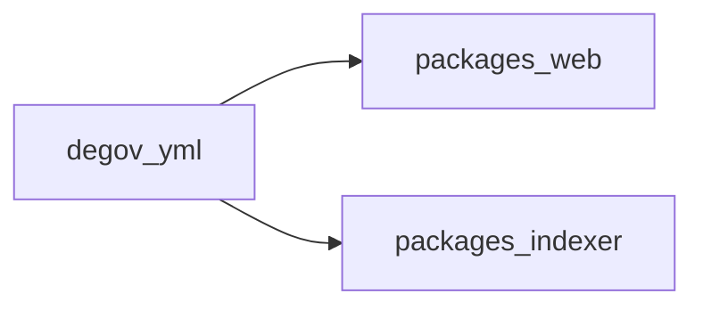

# Référence du fichier `degov.yml`

Le fichier `degov.yml` décrit une instance DAO pour DeGov : identité, chaîne, contrats, indexeur, thème, etc. Il est au format **YAML**.

Les types TypeScript de référence côté application web sont définis dans [`packages/web/src/types/config.ts`](../../packages/web/src/types/config.ts). Le runtime peut accepter des clés supplémentaires non typées ; les écarts importants sont signalés ci-dessous.

---

## Chargement et cycle de vie

| Contexte | Mécanisme | Fichiers |
|----------|-----------|----------|
| **Navigateur** | `fetch` du YAML (URL par défaut `/degov.yml` ou override via variables d’environnement publiques) | [`packages/web/src/hooks/useConfigSWR.ts`](../../packages/web/src/hooks/useConfigSWR.ts), [`packages/web/src/utils/remote-api.ts`](../../packages/web/src/utils/remote-api.ts) |
| **Serveur Next (local)** | Lecture de `public/degov.yml` | [`packages/web/src/lib/config.ts`](../../packages/web/src/lib/config.ts) |
| **Serveur Next (API DeGov)** | Récupération distante avec en-tête `x-degov-site`, cache par hôte | [`packages/web/src/app/api/common/config.ts`](../../packages/web/src/app/api/common/config.ts) |
| **Build web** | Script qui lit `DEGOV_CONFIG_PATH` (défaut `../../degov.yml`), enrichit la section `chain` depuis **viem** si l’`id` correspond, écrit `public/degov.yml` | [`packages/web/scripts/generate-config.mjs`](../../packages/web/scripts/generate-config.mjs) |
| **Service indexer** | `DEGOV_CONFIG_PATH` = chemin local **ou** URL `http(s)://` | [`packages/indexer/src/main.ts`](../../packages/indexer/src/main.ts), [`packages/indexer/src/datasource.ts`](../../packages/indexer/src/datasource.ts) |

**Post-traitement côté web** : après chargement, [`processStandardProperties`](../../packages/web/src/utils/helpers.ts) parcourt l’objet config et met en **majuscules** toute propriété nommée `standard` (ex. `erc20` → `ERC20`), y compris dans les objets imbriqués.

---

## Métadonnées DAO (racine)

| Champ | Obligatoire (web) | Description / usage |
|-------|-------------------|---------------------|
| `name` | Oui (attendu par l’UI) | Nom affiché ; métadonnées SEO et titre ([`layout.tsx`](../../packages/web/src/app/layout.tsx)) ; nom d’app RainbowKit ([`dapp.provider.tsx`](../../packages/web/src/providers/dapp.provider.tsx)). |
| `code` | Oui | **Identifiant stable** du DAO (chaîne courte, ex. `realtoken-dao`). Utilisé comme `daoCode` côté indexeur ([`datasource.ts`](../../packages/indexer/src/datasource.ts)), pour les clés de cache profil, notifications, appels API (`degovConfig.code`), corrélations multi-DAO. Doit rester aligné avec le backend / l’indexeur déployé. |
| `logo` | Fortement recommandé | URL du logo ; favicon / Open Graph ([`layout.tsx`](../../packages/web/src/app/layout.tsx)) ; en-tête DAO ([`dao-header.tsx`](../../packages/web/src/app/_components/dao-header.tsx)). |
| `siteUrl` | Recommandé | URL canonique du site ; `metadataBase` et Open Graph ([`layout.tsx`](../../packages/web/src/app/layout.tsx)). |
| `description` | Recommandé | Texte descriptif sous le titre ([`dao-header.tsx`](../../packages/web/src/app/_components/dao-header.tsx)). |
| `offChainDiscussionUrl` | Non | Lien vers le forum ou la discussion hors chaîne ([`proposals.tsx`](../../packages/web/src/app/_components/proposals.tsx)). |
| `editLink` | Non | URL du bouton « Edit » (souvent le dépôt ou le fichier YAML) ([`dao-header.tsx`](../../packages/web/src/app/_components/dao-header.tsx)). |

---

## `links`

Objet clé → URL (chaîne). Les entrées **vides** sont ignorées à l’affichage (filtre sur valeur non vide).

**Clés reconnues avec icône** dans [`dao-header.tsx`](../../packages/web/src/app/_components/dao-header.tsx) : `website`, `twitter`, `telegram`, `github`, `discord`, `email`, `coingecko`.

**Écart avec le typage** : l’interface `Links` dans [`types/config.ts`](../../packages/web/src/types/config.ts) ne liste pas `coingecko`, mais l’UI la gère au même titre que les autres. Vous pouvez l’ajouter dans le YAML pour un lien CoinGecko du jeton/écosystème.

---

## `theme` (optionnel)

| Champ | Usage |
|-------|--------|
| `logoDark` | Logo en thème sombre (sidebar, header mobile). |
| `logoLight` | Logo en thème clair. Les deux `logoDark` **et** `logoLight` doivent être définis pour activer le logo contextuel ([`aside.tsx`](../../packages/web/src/components/layouts/aside.tsx), [`mobile-header.tsx`](../../packages/web/src/components/layouts/mobile-header.tsx)). |
| `banner` | Image de fond du bandeau d’en-tête (desktop) lorsque le bandeau personnalisé est actif. |
| `bannerMobile` | Requis **en plus de** `banner` pour activer le bandeau personnalisé (`isCustomBanner`). L’image effective de fond utilisée dans le style est **`theme.banner`** ; `bannerMobile` sert aujourd’hui surtout de condition d’activation, pas d’URL distincte affichée dans ce composant ([`dao-header.tsx`](../../packages/web/src/app/_components/dao-header.tsx)). |
| `faqs` | Liste d’objets `{ question: string, answer: string }`. Le champ `answer` est typiquement une **URL** vers la doc. Au plus **5** entrées affichées sur le tableau de bord ([`faqs.tsx`](../../packages/web/src/components/faqs.tsx)). |

---

## `wallet`

| Champ | Description |
|-------|-------------|
| `walletConnectProjectId` | Identifiant projet **WalletConnect (v2)** ; transmis à Wagmi / RainbowKit ([`dapp.provider.tsx`](../../packages/web/src/providers/dapp.provider.tsx), [`wagmi.ts`](../../packages/web/src/config/wagmi.ts)). |

---

## `chain`

Utilisé pour construire la chaîne Wagmi / RainbowKit ([`createDaoChain`](../../packages/web/src/config/wagmi.ts)) et l’affichage (nom, logo chaîne, explorateur).

| Champ | Description |
|-------|-------------|
| `id` | Identifiant numérique de la chaîne (EVM), ex. `100` pour Gnosis. |
| `name` | Nom affiché (suffixe « Network » peut être retiré en UI via [`removeNetworkSuffix`](../../packages/web/src/utils/helpers.ts)). |
| `logo` | URL du logo de la chaîne (ex. menu « Contracts »). |
| `rpcs` | Liste d’URLs RPC **HTTP** (utilisées comme `http()` dans Wagmi). Au moins une URL est nécessaire pour éviter une erreur au démarrage. |
| `explorers` | Liste d’URLs de base d’explorateur ; la première sert pour les liens « voir sur l’explorateur » ([`contracts.tsx`](../../packages/web/src/app/_components/contracts.tsx)). |
| `nativeToken` | `symbol`, `decimals`, `priceId` (identifiant **CoinGecko** pour les cours), `logo` optionnel. Le `priceId` alimente les agrégations de prix ([`useTreasuryAssets.ts`](../../packages/web/src/hooks/useTreasuryAssets.ts)). |
| `contracts` | Optionnel : objet de contrats prédéployés **viem** (multicall, etc.), fusionné dans la définition RainbowKit si présent ([`types/config.ts`](../../packages/web/src/types/config.ts)). |

**Script `generate-config.mjs`** : si `chain.id` correspond à une chaîne connue de `viem/chains`, le script peut préremplir RPC, explorers et devise native depuis viem, puis **fusionner** avec les champs déjà présents dans le YAML (le YAML prime pour les surcharges).

---

## `indexer`

### Côté application web

| Champ | Description |
|-------|-------------|
| `endpoint` | URL du **endpoint GraphQL** (indexeur / squid) pour propositions, délégués, trésorerie indexée, etc. ([`packages/web/src/app/api/common/graphql.ts`](../../packages/web/src/app/api/common/graphql.ts) : `dc.indexer.endpoint`). |

### Côté service `packages/indexer`

Lu dans [`packDataSource`](../../packages/indexer/src/datasource.ts) avec `chain`, `code`, `contracts`.

| Champ | Obligatoire | Défaut dans le code | Description |
|-------|-------------|---------------------|-------------|
| `startBlock` | Oui (packager) | — | Bloc de départ d’indexation. |
| `rpc` | Non | — | RPC(s) **prioritaires** pour l’indexeur : le code fait `rpcs = [indexer.rpc, ...chain.rpcs]`. **Recommandation** : utiliser une **seule URL en chaîne** (scalaire YAML). Si `rpc` est une **liste** YAML (`- url`), le premier élément de `rpcs` peut devenir un tableau imbriqué au lieu d’une chaîne, ce qui est incompatible avec `rpcs: string[]` attendu plus bas — préférer un scalaire ou ne mettre les RPC que dans `chain.rpcs`. |
| `finalityConfirmation` | Non | `50` | Confirmations de finalité (Subsquid / SDK). |
| `capacity` | Non | `30` | Capacité du pipeline (voir commentaires Subsquid dans l’exemple [`degov.yml`](../../degov.yml)). |
| `maxBatchCallSize` | Non | `200` | Taille max des lots d’appels RPC. |
| `gateway` | Non | — | Passerelle Subsquid Network (optionnel). |
| `endBlock` | Non | — | Borne haute d’indexation optionnelle ([`IndexerProcessorConfig`](../../packages/indexer/src/types.ts)). |

L’indexeur ne prend dans `contracts` que **`governor`** et **`governorToken`** (filtre explicite). Les autres clés (`timeLock`, etc.) sont ignorées par ce service.

---

## `contracts`

| Champ | Type | Description |
|-------|------|-------------|
| `governor` | Adresse (string `0x…`) | Contrat Governor affiché et indexé. |
| `governorToken` | Objet | `address`, `standard` (ex. `ERC20`, `ERC721`). La valeur `standard` est normalisée en majuscules côté web. |
| `timeLock` | Adresse optionnelle | Si présent, affiché dans le menu « Contracts » ([`contracts.tsx`](../../packages/web/src/app/_components/contracts.tsx)). |

Pour l’assembleur d’indexeur, `governor` peut être une chaîne ; `governorToken` peut être un objet avec `address` (et `standard` pour métadonnées).

---

## `treasuryAssets`

Tableau d’actifs affichés / valorisés dans la trésorerie. Champs alignés sur `TokenDetails` dans [`types/config.ts`](../../packages/web/src/types/config.ts) :

- `name`, `contract`, `standard`, `logo` (peut être `null` selon le typage),
- `priceId` optionnel : identifiant **CoinGecko** pour les prix ([`useCryptoPrices`](../../packages/web/src/hooks/useCryptoPrices.ts)).

---

## `safes`

Liste d’objets `{ name, chainId, link }` pour raccourcis vers les Safe (ex. Gnosis Safe) ([`safe-list.tsx`](../../packages/web/src/components/treasury-list/safe-list.tsx)).

---

## `apps`

Liste d’applications liées : `name`, `description`, `icon` (URL), `link` ([`apps/page.tsx`](../../packages/web/src/app/apps/page.tsx)).

Les champs `params` éventuels dans des exemples YAML commentés **ne sont pas** consommés par cette page dans l’état actuel du code.

---

## `aiAgent` (optionnel)

| Champ | Description |
|-------|-------------|
| `endpoint` | URL du service d’analyse IA. Sans cet endpoint, les fonctionnalités qui dépendent de [`useAiAnalysis`](../../packages/web/src/hooks/useAiAnalysis.ts) restent désactivées. |

---

## `analysis` (optionnel)

| Champ | Description |
|-------|-------------|
| `ga.tag` | Identifiant de mesure **Google Analytics** (chargement des scripts `gtag`) ([`layout.tsx`](../../packages/web/src/app/layout.tsx), composant `AnalyticsScripts`). |

---

## Synthèse des consommateurs

| Section principale | Web (`packages/web`) | Indexeur (`packages/indexer`) |
|--------------------|----------------------|----------------------------------|
| Métadonnées, `links`, `theme`, `wallet`, `chain` (hors RPC indexer), `contracts`, `treasuryAssets`, `safes`, `apps`, `aiAgent`, `analysis` | Oui | Non |
| `indexer.endpoint` | Oui (GraphQL) | Non |
| `indexer.*` sauf `endpoint` | Non | Oui (`startBlock`, `rpc`, `finalityConfirmation`, `capacity`, `maxBatchCallSize`, `gateway`, `endBlock`) |
| `chain.rpcs`, `chain.id`, `code`, `contracts.governor`, `contracts.governorToken` | Oui | Oui |

Pour toute évolution du schéma, mettre à jour ce document et, si besoin, [`packages/web/src/types/config.ts`](../../packages/web/src/types/config.ts).
